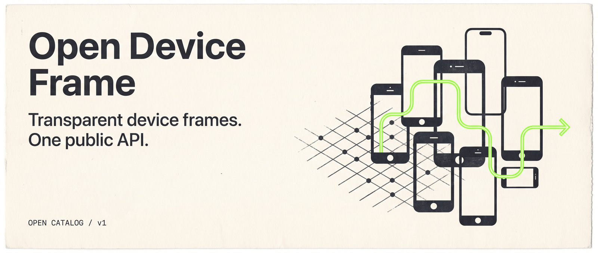

# Open Device Frame

Open Device Frame is an open, repository-backed catalog of transparent
smartphone frame assets and a public device image API. The Git-tracked catalog
records and WebP assets are the source of truth; the website and API are
deterministic views over that data.

## What you get

- Transparent, black, front-facing device-frame WebP assets.
- Searchable canonical metadata, aliases, hardware model numbers, and brands.
- A public read API for device resolution and asset discovery.
- Community issue workflows for missing devices and corrections.

## Quick start

```bash
pnpm install
pnpm catalog:build
pnpm verify
pnpm dev
```

## Catalog and assets

- Records: `catalog/devices/<brand>/<device>.json`
- Generated indexes: `catalog/generated/` — never edit manually
- Assets: `public/devices/<brand>/<device>.webp`

Each asset has a transparent background and display opening. It is a
community-created illustration, not manufacturer-authorized photography.

## API

- `GET /api/v1/devices/:id`
- `GET /api/v1/resolve?model=Pixel%209%20Pro`
- `GET /api/v1/search?q=pixel`
- `GET /api/v1/brands`
- `GET /api/v1/brands/:brand/devices`
- `GET /api/v1/catalog`

See `/api-docs` in the running application for response examples and errors.

## Deploy on Vercel

1. Import this GitHub repository into Vercel.
2. Set `NEXT_PUBLIC_SITE_URL` to the production URL, for example
   `https://open-device-frame.vercel.app`.
3. Deploy. The site publishes `robots.txt`, `sitemap.xml`, canonical URLs,
   Open Graph metadata, and device-specific metadata for crawlers.

For the optional GitHub issue form, configure `GITHUB_TOKEN` with least-
privileged Issues write access and `GITHUB_REPOSITORY` as `owner/repo`. Never
give either variable a `NEXT_PUBLIC_` prefix.

## Licensing

No license has been selected. Code, catalog data, and image assets require
separate licensing decisions before public contributions are accepted.
